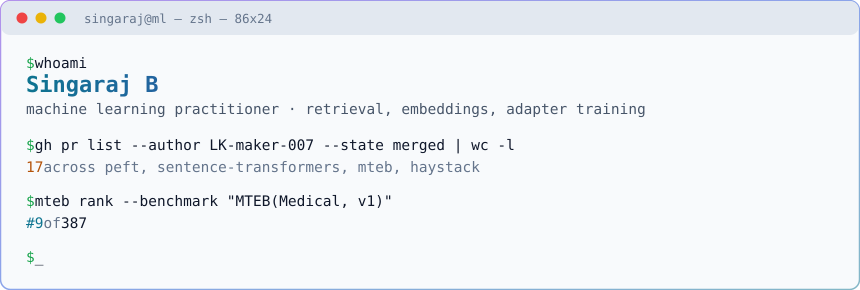

<picture>
  <source media="(prefers-color-scheme: dark)" srcset="header-terminal-dark.svg">
  
</picture>

```console
$ gh pr list --author LK-maker-007 --state merged --json repository

huggingface/sentence-transformers   5   semantic search, ONNX export, hard-negative mining
huggingface/peft                    3   DoRA merge and unmerge, adapter injection
embeddings-benchmark/mteb           5   first Mauritian Creole task, model entries
embeddings-benchmark/results        3   published evaluation results
deepset-ai/haystack                 1   typing.Literal serialisation
                                   --
                                   17   merged, every diff and review thread public
```

Six of the fixes are the same bug class, which is the one I keep finding: **something fails
and reports success.**

```python
# peft#3534  an adapter targeting no modules attached silently and trained nothing
model.add_adapter("second", LoraConfig(target_modules=["does_not_exist"]))
# before:  returns cleanly and attaches an adapter that adapts nothing
# after:   raises NoMatchingPeftModuleError

# sentence-transformers#3909  a 1-D query embedding read as a batch
semantic_search_qdrant(query_embeddings=one_query)
# before:  30,522 vector searches, 30,522 identical result rows
# after:   one search
```

### Models

```console
$ hf api models/Singaraj --jq '.[] | "\(.id)  \(.downloads)/30d"'

Singaraj/morisien-embed-v1.5        178/30d   0.928 mean F1, MTEB task I also authored
Singaraj/morisien-embed             153/30d   first embedding model for Mauritian Creole
Singaraj/sante-embed                159/30d   rank 9 of 389, MTEB(Medical, v1)
Singaraj/MorisienMTBitextMining      63/30d   benchmark task, MIT
```

**sante-embed** is 1.5B, rank 9 of 389 on MTEB(Medical, v1). It is one of the
161 models that submitted all 12 tasks, and is rank 8 among them.

**morisien-embed** is the first text embedding model for Mauritian Creole, and
`MorisienMTBitextMining` is the language's first task in MTEB. Auditing the obvious evaluation
split turned up 97% of Kreyòl-MT's test set already inside the training data I was merging. I
benchmarked on MorisienMT's test split instead, which shares no Creole sentence with training.

### Writing

[morisien-embed: Text Embedding Models and Evaluation for Mauritian Creole](https://doi.org/10.5281/zenodo.21877805).
Sole author, indexed in OpenAIRE. Model, dataset and training code under MIT.

<p>
<a href="https://huggingface.co/Singaraj"></a>
<a href="https://orcid.org/0009-0002-1502-362X"></a>

</p>
